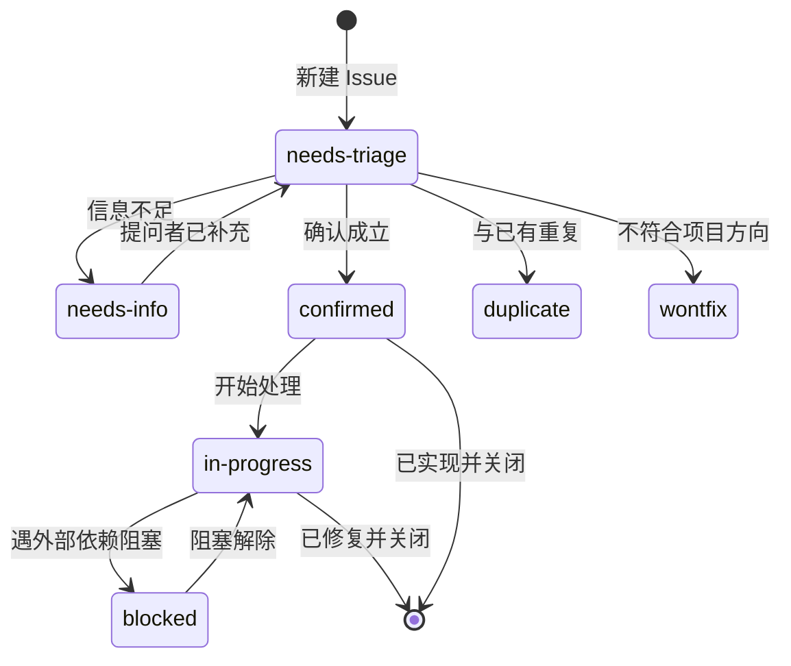

# 标签体系

本仓库的 Issue 使用**四个正交维度**来标注：**类型**、**模块**、**优先级**、**状态**。
一个 Issue 通常同时带有 1 个类型 + 1 个模块 + 1 个优先级 + 1 个状态标签。

机器可读的标签定义见 [`labels.yml`](labels.yml)（`.github/` 目录下），
可用于 label-sync 类工具批量同步。

---

## 1. 类型标签 `type:`

描述**这个 Issue 属于什么性质的工作**。

| 标签 | 颜色 | 含义 | 典型例子 |
|------|------|------|----------|
| `type: bug` | 🔴 红 | 功能与预期不符 | 点击保存后数据没落库 |
| `type: feature` | 🟢 绿 | 现在没有的新能力 | 希望支持导出为 Anki 牌组 |
| `type: enhancement` | 🔵 蓝 | 能力已有但不够好 | 复习页希望支持键盘快捷键 |
| `type: refactor` | 🟣 紫 | 重构，**行为不应改变** | 把胖路由拆成三层 |
| `type: perf` | 🟡 黄 | 性能问题 | 打开日历卡顿 3 秒 |
| `type: docs` | 🔵 蓝 | 文档 | README 里的端点计数过时 |
| `type: chore` | ⚪ 灰 | 依赖升级、脚本、配置 | 升级 better-sqlite3 |
| `type: question` | 🟪 品红 | 使用疑问 | 数据目录能不能换到外置硬盘 |

> 💡 选择建议：
> 如果你认为「现在完全做不到」→ `feature`；「能做但别扭」→ `enhancement`。
> 如果代码改动**不打算改变任何可观察行为**（如拆层、改名）→ `refactor`。

---

## 2. 模块标签 `area:`

描述**影响范围**。一个 Issue 可以有多个（跨模块问题时请都标上）。

| 标签 | 覆盖范围 |
|------|----------|
| `area: inbox` | 收集箱、剪藏、语音/截图录入、待处理整理 |
| `area: notes` | 康奈尔笔记、双链与反链、笔记 AI 能力、笔记导出 |
| `area: memory` | 记忆宫殿、地点、主动回忆 |
| `area: review` | 间隔重复、SM-2 算法、闪卡、遗忘曲线与热力图 |
| `area: library` | 文档库（本地 Markdown 工作台）、vault、资源与待办扫描 |
| `area: mindmap` | 思维导图三视图、markmap 渲染、大纲编辑 |
| `area: diagram` | 绘图工具白板、形状库、连线、导出 |
| `area: tasks` | 任务清单、智能列表、清单树、子任务 |
| `area: calendar` | 日历视图、四象限、日期与节假日 |
| `area: habits` | 习惯打卡、连续天数、热力图 |
| `area: pomodoro` | 番茄钟计时引擎、白噪音、提示音、统计 |
| `area: ai` | AI 助手、知识库问答（RAG）、学习日报、LLM provider |
| `area: voice` | 离线语音（Whisper STT / Piper TTS）、OCR、模拟面试 |
| `area: settings` | 设置中心、备份、配置与数据目录、新手引导 |
| `area: tauri` | 桌面外壳、窗口、托盘、通知、自动更新、侧车托管 |
| `area: build` | 构建脚本、打包配置、CI、发布流程 |
| `area: ui` | 设计令牌、主题（明/暗、强调色）、全局组件与布局 |

---

## 3. 优先级标签 `priority:`

描述**多紧急**。判定依据是「影响面 × 严重度」，不是「谁提的」。

| 标签 | 级别 | 判定标准 | 处理原则 |
|------|------|----------|----------|
| `priority: P0` | 🔴 阻断 | **数据丢失 / 应用无法启动 / 崩溃 / 安全漏洞** | 立即处理，优先于一切新功能 |
| `priority: P1` | 🟠 高 | 核心流程不可用，且**没有绕过方案**（如无法保存笔记、无法复习） | 优先于新功能开发 |
| `priority: P2` | 🟡 中 | 影响体验，但**存在可接受的绕过方案** | 按正常排期处理 |
| `priority: P3` | 🟢 低 | 打磨类：文案、间距、边缘场景、少用路径 | 有余力时处理 |

### 判定示例

- 「删除习惯后，该习惯的历史打卡记录让 `GET /api/habits` 报错」→ **P0**（数据不一致 + 核心接口坏）
- 「未配置 AI Key 时点『生成日报』白屏」→ **P1**（违反优雅降级硬要求，且无绕过）
- 「深浅色切换后顶栏下拉面板仍是白底浅字」→ **P2**（影响体验，可切回浅色绕过）
- 「四象限卡片标题超长时溢出 1px」→ **P3**（打磨）

> ⚠️ **优先级不是承诺**。本项目由维护者在业余时间维护，
> 标注优先级是为了让排序透明，不代表具体交付时间。

---

## 4. 状态标签 `status:`

描述**这个 Issue 当前处于什么阶段**。

| 标签 | 含义 | 谁负责推进 |
|------|------|-----------|
| `status: needs-triage` | 刚提交，尚未分类 | 维护者 |
| `status: needs-info` | 信息不足，等提问者补充（缺环境信息、缺复现步骤等） | **提问者** |
| `status: confirmed` | 已确认成立，等待排期 | 维护者 |
| `status: in-progress` | 正在处理 | 维护者 / 贡献者 |
| `status: blocked` | 被外部依赖或前置决策阻塞（如等某个上游修复） | 维护者 |
| `status: wontfix` | 明确不计划修复，理由会写在 Issue 里 | — |
| `status: duplicate` | 与已有 Issue 重复，会附上原 Issue 链接 | — |

### 状态流转



> `status: needs-info` 若长时间无补充，会被关闭（关闭时说明原因，随时可重新打开）。

---

## 5. 其他标签

| 标签 | 用途 |
|------|------|
| `good first issue` | 适合首次贡献者，改动范围小且有明确指引 |
| `help wanted` | 欢迎社区认领，维护者已给出方向 |
| `breaking change` | 会破坏向后兼容（数据格式、配置项、行为语义） |
| `security` | 安全问题。**若涉及可利用漏洞，请勿公开讨论细节** |
| `dependencies` | 依赖升级类改动（常由自动化工具创建） |

---

## 6. 给贡献者的建议

**提交时**：模板会自动带上 `type:` 与 `status: needs-triage`。
如果你能明确模块与优先级，欢迎自己补上 `area:` / `priority:`——
这能省一轮沟通。

**认领时**：请先确认 Issue 已有 `status: confirmed` 或 `help wanted`，
然后在 Issue 下留言说明你要处理，避免与其他人撞车。开始后请把状态改为
`status: in-progress`。

**提交 PR 时**：在 PR 描述里用 `Closes #123` 关联 Issue。
PR 合并后 Issue 状态会被自动关闭。

---

## 7. 同步标签定义

`labels.yml` 是**机器可读的标签定义**。若仓库启用了 label-sync 类工作流，
它会按该文件自动创建/更新标签。手动同步也可用 GitHub CLI：

```bash
# 查看现有标签
gh label list --repo beiluoL/LectoForge

# 创建单个标签（示例）
gh label create "type: bug" --color d73a4a --description "功能与预期不符" \
  --repo beiluoL/LectoForge
```

> 📌 **Gitee 侧说明**：Gitee 的标签体系与 GitHub 不通用，需在仓库
> 「管理 → 标签管理」中手工创建。本文件可作为名称与颜色的对照表。
> Gitee 的 Issue 模板见仓库根目录的 `.gitee/ISSUE_TEMPLATE.md`。
