<div align="center">

# LectoForge · 学习工作台

**本地优先的 macOS 学习工作台 —— 把「收集 → 整理 → 内化 → 输出」做成一条真正会转的学习闭环。**

数据全部留在你自己的电脑上：没有账号、没有服务端、没有遥测。

[](CHANGELOG.md)
[](LICENSE)
[](#环境要求)
[](https://tauri.app/)
[](https://vuejs.org/)

[GitHub](https://github.com/beiluoL/LectoForge) ｜ [Gitee](https://gitee.com/beiluol/lecto-forge) ｜ [架构文档](docs/ARCHITECTURE.md) ｜ [更新日志](CHANGELOG.md) ｜ [功能详解](docs/FEATURES.md)

</div>

---

## 这是什么

大多数笔记软件能帮你**记下来**，但记下来之后呢？LectoForge 关注的是记下来**之后**的事：

- 收集箱里堆着的碎片，怎么变成一条条有结构的笔记？
- 笔记里的知识，怎么让它在两周后还留在脑子里，而不是过目就忘？
- 学完的东西，怎么证明自己真的懂了，而不是「看懂了」？

它把认知科学里几套被验证过的方法——**康奈尔笔记**、**间隔重复（SM-2）**、
**记忆宫殿**、**费曼技巧**——做成了四个互相咬合的模块，
再用**主动智能**（学习日报 / 薄弱点诊断）在背后推着你走完闭环。

它同时也是一个**本地优先**的桌面应用：SQLite 单文件、原生 Markdown 文档库、
离线语音识别与合成。除了 AI 问答需要你自备 API Key，其余功能全部离线可用。

<table>
<tr>
<td width="50%">

**核心定位**

- 🎯 围绕「学完能记住」设计，不是又一个笔记仓库
- 🔒 数据 100% 本地：SQLite + 本地文件夹，随时可打包带走
- 📴 离线优先：语音识别/合成本地跑，AI 可用本地 Ollama
- 🧩 高度可组合：四个模块既可单用，也能串成闭环
- 🍎 原生化：无边框窗口、原生托盘倒计时、系统通知

</td>
<td width="50%">

**适合谁**

- 正在系统学习一门新技术，需要「输入→内化→输出」全流程工具
- 备考 / 面试冲刺，需要大量记忆与自测
- 想要本地、可迁移、不被平台锁定的知识资产
- 喜欢 Obsidian 式「文件即数据」，但还想要 SRS 与复盘能力

</td>
</tr>
</table>

---

## 界面一览

> 以下截图均取自**隔离的演示环境**（独立数据目录 + 通用示例内容），不含任何真实个人数据。

### 工作台总览

<p align="center">
  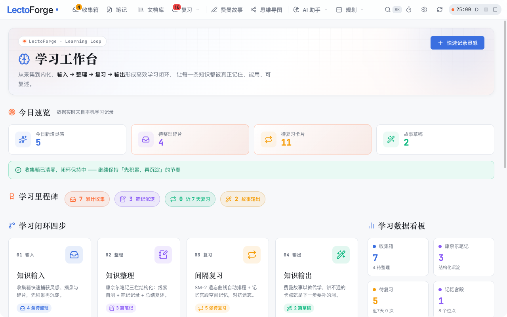
</p>

六指标看板 + 学习闭环四步导航 + 今日聚焦四卡。待整理、待复习、故事草稿等关键指标一目了然。

### 收集箱：先积累，再沉淀

<p align="center">
  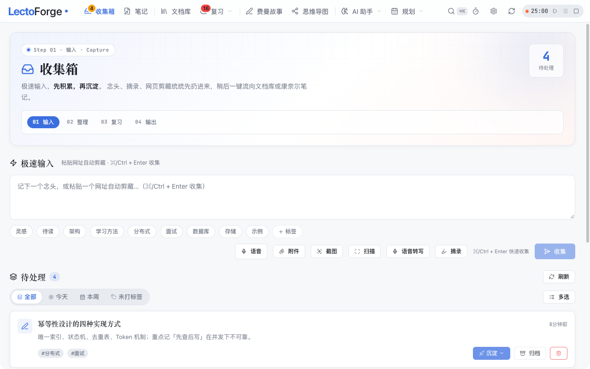
</p>

速记 / 剪藏 / 语音 / 截图 / 附件五种入口，标签一键归类，待处理项一键「沉淀」为结构化笔记。

### 康奈尔笔记：线索栏 · 笔记栏 · 总结栏

<p align="center">
  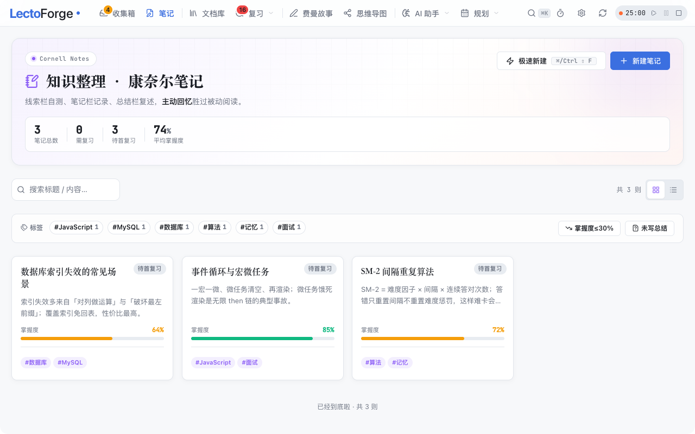
</p>

左侧线索栏自测、右侧笔记栏记录、下方总结栏复述——**主动回忆胜过被动阅读**。
支持掌握度评分、标签聚合、AI 续写与自测题生成。

### 间隔重复：SM-2 排期 + 四档评分

<p align="center">
  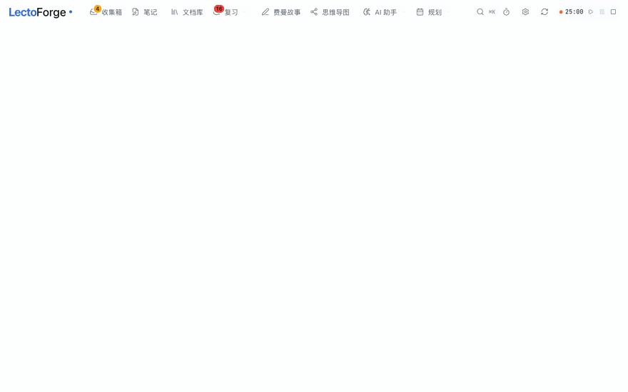
</p>

翻卡 → 看答案 → 评「困难 / 良好 / 轻松 / 完美」，SM-2 据此计算下次到期时间。
间隔基于「上次复习时间 + interval」，而非当前时间累加——这是排期正确的关键。

<details>
<summary>查看复习页静态截图</summary>

<p align="center">
  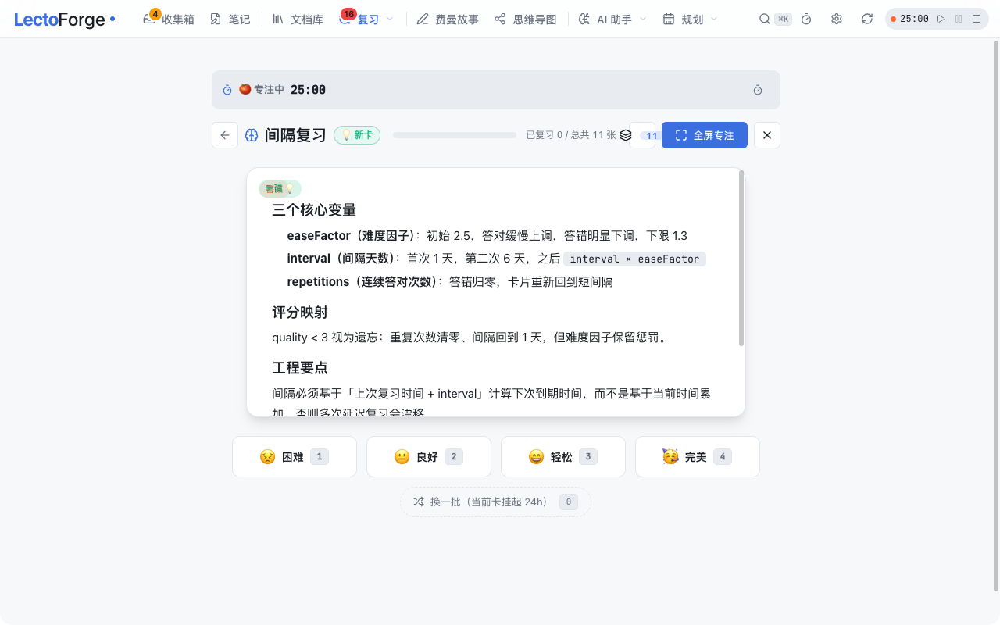
</p>

</details>

### 文档库：Obsidian 式本地 Markdown 工作台

<p align="center">
  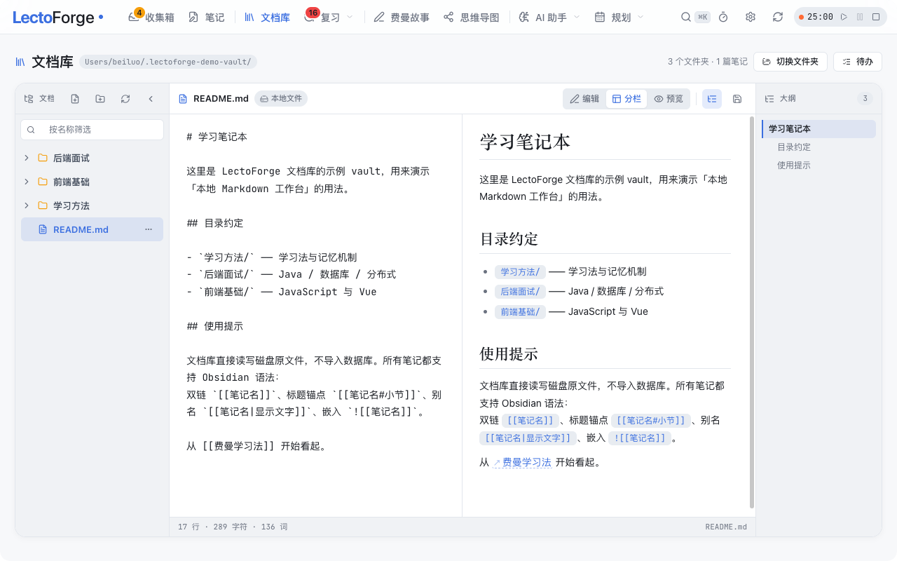
</p>

选任意本地文件夹作为 vault，**直接读写原文件**（不导入数据库）。
三栏布局：目录树 · 源码/分栏/预览 · 大纲。兼容 Obsidian 双链 `[[笔记]]`、`[[笔记#标题]]`、
`[[笔记|别名]]`、嵌入块 `![[...]]`，点击双链直接跳转。

### 思维导图与流程图

<table>
<tr>
<td width="50%">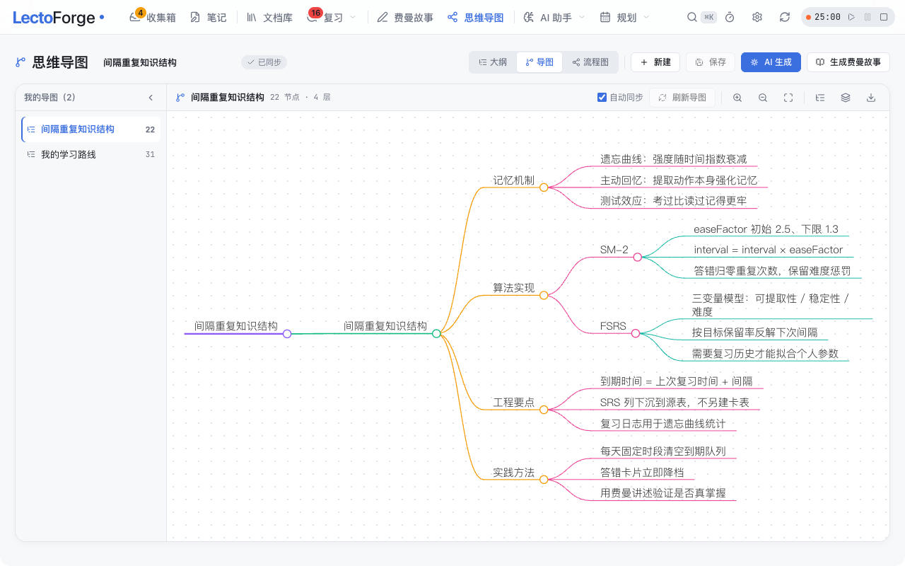</td>
<td width="50%">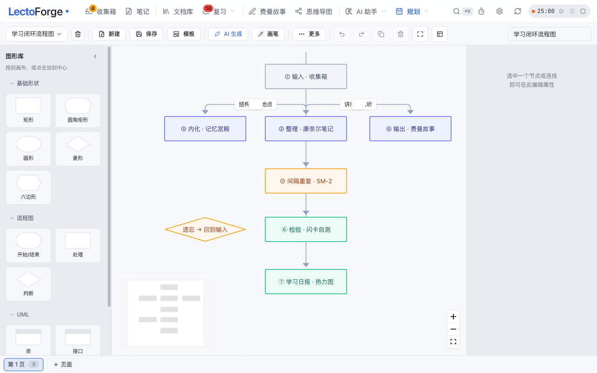</td>
</tr>
<tr>
<td>同一份文档三视图：极简大纲 / 导图 / 流程图，支持 AI 生成</td>
<td>类 draw.io 白板：11 种形状、四向互联、撤销重做、导出 PNG/SVG</td>
</tr>
</table>

### 规划：任务清单 · 四象限 · 日历 · 习惯

<table>
<tr>
<td width="50%">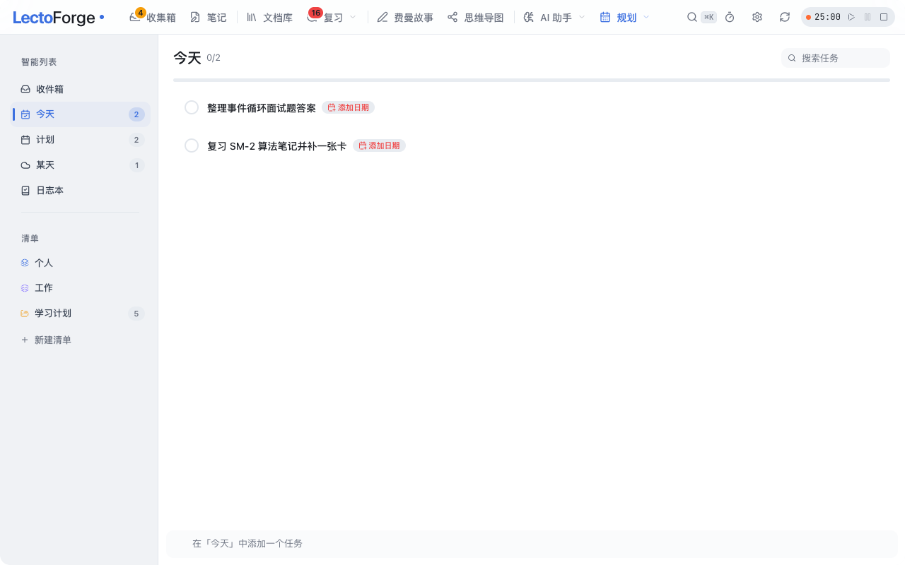</td>
<td width="50%">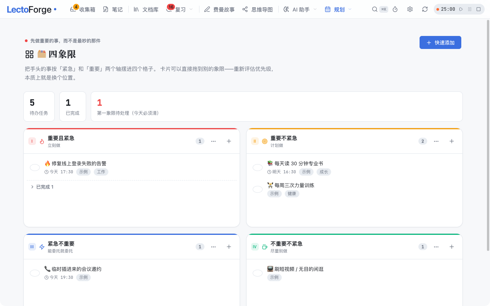</td>
</tr>
<tr>
<td>对标 Things 3：智能列表 + 自定义清单树 + 子任务 + 日历联动</td>
<td>艾森豪威尔矩阵：拖拽换象限、勾选完成、清空已完成</td>
</tr>
<tr>
<td>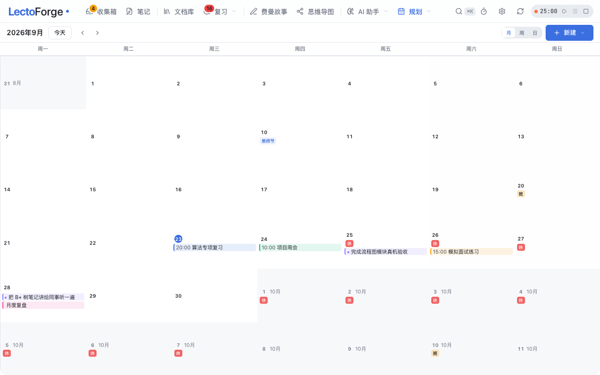</td>
<td>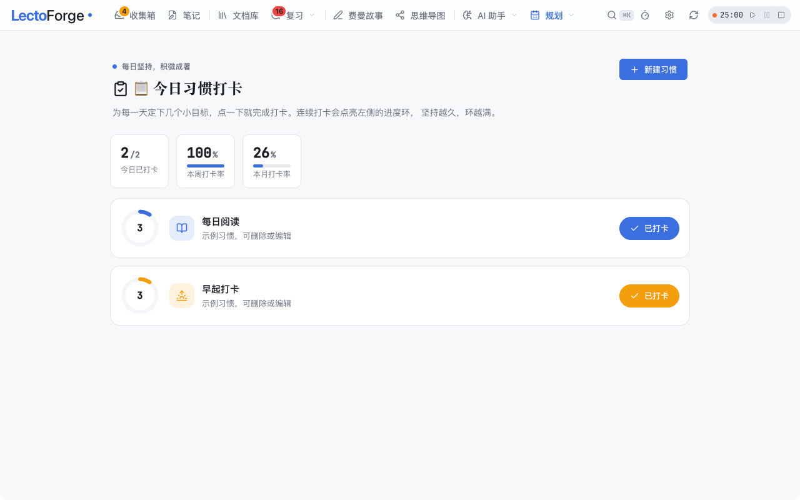</td>
</tr>
<tr>
<td>月/周/日三视图，任务与事件进同一张时间网格</td>
<td>连续天数进度环 + GitHub 风格年热力图，可补卡</td>
</tr>
</table>

### 专注：番茄钟

<p align="center">
  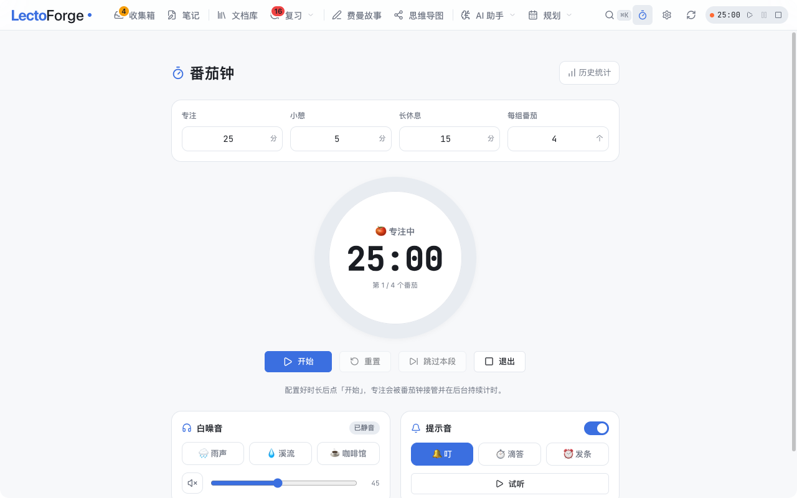
</p>

计时引擎常驻 Pinia store，**切页不中断**；阶段与倒计时实时烘进**状态栏图标**；
白噪音播放器 + Web Audio 合成提示音；专注记录进统计页柱状图。

### AI 助手：多轮对话 + 知识库问答

<table>
<tr>
<td width="50%">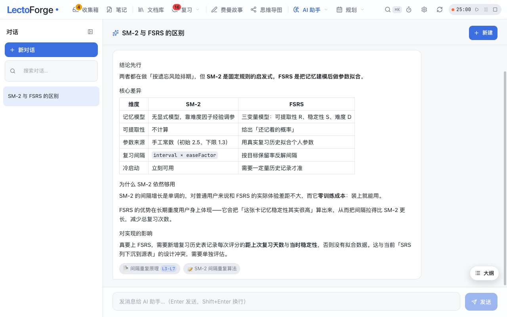</td>
<td width="50%">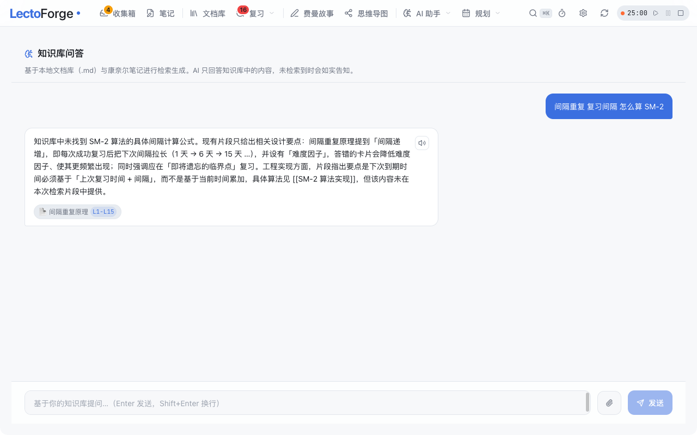</td>
</tr>
<tr>
<td>对标 DeepSeek 网页端：会话管理、流式输出、Markdown 表格、消息反馈</td>
<td>RAG 检索本地文档库，回答带<b>来源药丸 + 精确行号锚点</b>，点击跳回原文高亮</td>
</tr>
</table>

### 设置中心

<p align="center">
  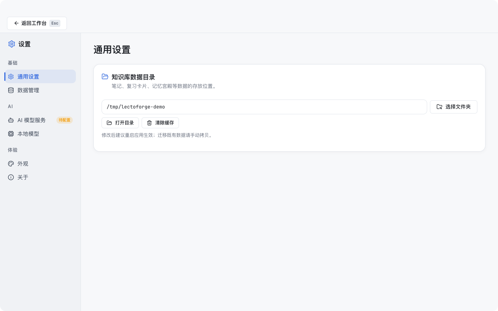
</p>

数据目录、AI 模型服务、本地模型、外观主题、数据备份与更新。

---

## 功能总览

### 学习闭环四模块

| 模块 | 路由 | 做什么 | 亮点 |
|------|------|--------|------|
| **收集箱** | `/inbox` | 速记、网页剪藏、语音、截图、附件 | 五种入口；批量处理；去重检测；一键沉淀为笔记或记忆宫殿地点 |
| **康奈尔笔记** | `/workbench/notes` | 线索栏 · 笔记栏 · 总结栏三栏编辑 | 掌握度评分；双链 `[[...]]` + 反向引用；AI 续写 / 自测题 / 生成导图 |
| **记忆宫殿** | `/workbench/palace` | 地点法编码 + 主动回忆 | 图片提示；巡检式回忆打卡 |
| **费曼故事** | `/workbench/story` | 用自己的话讲一遍 | AI 起草 + 清晰度评分，讲不清就是没懂 |
| **间隔重复** | `/review` | SM-2 排期 + 四档评分 | 遗忘曲线；热力图；卡组挂起；番茄钟内嵌 |

### 资料与创作

| 模块 | 路由 | 说明 |
|------|------|------|
| **文档库** | `/library` | Obsidian 式本地 Markdown 工作台，直读磁盘原文件；三栏 + 双链 + 待办扫描 |
| **思维导图** | `/mindmap` | 大纲 /导图 / 流程图三视图；AI 一键生成 |
| **绘图工具** | `/diagram` | 类 draw.io 白板：11 种形状、四向互联、多页、导出 PNG/SVG |

### 规划与执行

| 模块 | 路由 | 说明 |
|------|------|------|
| **任务清单** | `/tasks` | Things 3 式：五个智能列表 + 清单树 + 子任务 + 目标日/截止日 + 日历联动 |
| **四象限** | `/quadrant` | 艾森豪威尔矩阵，原生 HTML5 拖拽换象限 |
| **日历** | `/calendar` | 月/周/日三视图，任务与事件统一网格；**范围查询**（不拉全量） |
| **习惯打卡** | `/habits` | 连续天数进度环 + GitHub 风格年热力图，可补卡 |
| **番茄钟** | `/pomodoro` | 后台常驻计时 + 状态栏图标指示 + 白噪音 + Chart.js 统计 |

### AI 与语音

| 模块 | 路由 | 说明 |
|------|------|------|
| **AI 助手** | `/ai-assistant` | 多轮对话，流式输出、Markdown 渲染、消息反馈、悬浮大纲 |
| **知识库问答** | `/ai-chat` | RAG：检索文档库 + 康奈尔笔记后作答，**回答带来源与行号锚点** |
| **学习日报** | `/daily-report` | 主动智能：昨日流入/复习/薄弱点 Top3/转化率，一键生成强化闪卡 |
| **模拟面试** | `/interview` | 语音对话式面试，本地题库抽题，SSE 流式点评与追问 |
| **题库管理** | `/interview-bank` | 面经 Markdown / PDF 导入；从复习卡与笔记一键导入 |

### 基础设施

| 能力 | 说明 |
|------|------|
| **AI provider 无关** | DeepSeek / OpenAI / 本地 Ollama，切 `baseUrl` 即可；未配 Key 时优雅降级 |
| **离线语音** | STT：whisper.cpp 双轨（原生侧车 + WASM）；TTS：本地 Piper + 浏览器合成 |
| **离线 OCR** | tesseract.js（WASM），中文优先，截图识字进收集箱 |
| **数据备份** | 一键打包 zip（含 WAL checkpoint 保证一致性）+ 每日定时自动备份 |
| **侧车自愈** | Node 后端异常退出后 2s→30s 退避无限重启；前端断线自动重连 |
| **历史数据迁移** | 更名（KnowFlow → LectoForge）后自动一次性迁移旧数据，幂等且保留旧目录 |

> 每个模块的技术取舍、踩坑记录与实现细节见 [`docs/FEATURES.md`](docs/FEATURES.md)。

---

## 技术栈

| 层 | 技术 | 选型理由 |
|----|------|----------|
| 桌面外壳 | **Tauri 2** + Rust | 用系统 WKWebView，产物约 220MB（含 Node 运行时）；Electron 同功能约 2 倍 |
| 后端 | **Node.js + TypeScript + Fastify** | 与 Web 端共享同一套端点契约与 SRS 算法，避免两套实现漂移 |
| 数据 | **SQLite（better-sqlite3，WAL）** | 单文件本地库，离线优先；同步 API 免去异步事务竞态 |
| 访问层 | **Drizzle ORM** | 类型安全且贴近 SQL，行为可预测，不像 ActiveRecord 那样隐式 N+1 |
| 前端 | **Vue 3 + Vite + Pinia + vue-router** | 组合式 API + `<script setup>`；16 个 store 管状态 |
| 样式 | **Tailwind（仅布局）+ CSS 变量** | 外观全部走 `--kb-*` 设计令牌，明暗与强调色可整体切换 |
| 编辑器/渲染 | markdown-it + highlight.js + KaTeX | 统一渲染入口 `lib/markdown.ts` |
| 图与图表 | AntV X6 / Vue Flow / markmap / Chart.js | 流程图、导图、统计图 |
| 语音 | whisper.cpp · Piper · tesseract.js | 全离线 |

### 通信方式

Node 后端**同源托管** Vue `dist` 与 `/api/*`，窗口加载 `http://127.0.0.1:8787`：

- **零 CORS**：前后端同源，无需跨域配置
- **vue-router 保持 history 模式**：可以直接用路径导航
- **不需要 WebSocket**：SSE 只用于模拟面试的流式点评
- **响应信封统一** `{ code: 200, data }`，由 `onSend` 钩子唯一负责包装

---

## 安装与使用

### 环境要求

| 项 | 版本 | 备注 |
|----|------|------|
| macOS | 12 及以上 | 仅支持 macOS（依赖 WKWebView 与原生托盘 API） |
| Node.js | **24.16.0** | **强约束**，见下方说明 |
| Rust | 1.97+ | 仅从源码打包时需要 |

> ⚠️ **Node 版本是硬约束，不是建议。**
> 后端依赖 `better-sqlite3`（原生模块），Node 24 的 ABI 号是 **137**，Node 22 是 **127**。
> 版本不匹配会在启动瞬间抛 `ERR_DLOPEN_FAILED`，表现为后端崩溃、前端 `ECONNREFUSED`。
>
> ```bash
> nvm install 24.16.0
> export PATH="$HOME/.nvm/versions/node/v24.16.0/bin:$PATH"
> node -p "process.versions.modules"   # 必须输出 137
> ```

### 方式一：下载安装包

从 [Releases](https://github.com/beiluoL/LectoForge/releases) 下载最新的 `.dmg` 或 `.app`。

> ⚠️ 当前构建产物是 **ad-hoc 签名**，未做 Apple Developer ID 签名与公证。
> 首次打开若被 Gatekeeper 拦截，执行：
>
> ```bash
> xattr -cr "/Applications/LectoForge 学习工作台.app"
> open "/Applications/LectoForge 学习工作台.app"
> ```

首次启动会进入**新手引导**（`/onboarding`），可在此配置 AI Key，也可以跳过后续再配。

### 方式二：从源码运行

```bash
git clone git@github.com:beiluoL/LectoForge.git
cd LectoForge

# 切换到正确的 Node 版本
nvm install 24.16.0 && nvm use 24.16.0

# 安装依赖
npm --prefix src-api install
npm --prefix src-ui  install
npm install

# 纯前后端开发（不需要 Rust）→ 打开 http://localhost:5173
npm run dev:all

# 或启动完整桌面应用（需要 Rust）
bash scripts/prepare-bin.sh        # 生成 Node 侧车二进制
npm run tauri dev
```

### 常用命令

| 命令 | 作用 |
|------|------|
| `npm run dev:all` | 同时启动前端（5173）与后端（8787） |
| `npm run dev:web` / `npm run dev:api` | 单独启动前端 / 后端 |
| `npm run build:all` | 构建前端与后端产物 |
| `npm run tauri dev` | 启动完整桌面应用（开发模式） |
| `npm run tauri build` | 打包 `.app` / `.dmg` |
| `npm run ui:theme-check` | UI 主题回归检查（需 `playwright-core`） |
| `bash scripts/fetch-models.sh` | 下载离线模型（OCR / 语音） |

### 数据存放位置

| 位置 | 内容 |
|------|------|
| `~/Library/Application Support/com.lectoforge.desktop/` | SQLite 主库、AI 配置、上传件、日志 |
| 你自己选择的文件夹 | 文档库 vault（直接用 Markdown 原文件） |

后端也支持通过环境变量覆盖数据目录，便于隔离调试：

```bash
LECTOFORGE_DATA_DIR=/tmp/lf-dev npm --prefix src-api run dev
```

> 💡 调试时**务必**用 `LECTOFORGE_DATA_DIR` 指向临时目录，避免污染真实学习数据。

### 启用离线语音（可选）

语音模型体积较大，不随仓库分发，需单独获取：

```bash
bash scripts/fetch-models.sh     # tesseract（OCR）+ whisper（语音识别）模型
bash scripts/build-whisper.sh    # 编译 whisper-server
bash scripts/build-piper.sh      # 编译 Piper（本地 TTS）
bash scripts/run-whisper.sh      # dev 环境手动启动 whisper 侧车
```

缺资源时应用会给出明确提示并优雅降级，不会崩窗。

---

## 目录结构

```
desktopApp/
├── src-ui/                    Vue 3 前端（Vite + Pinia + vue-router）
│   ├── src/views/             业务页面（36 条路由；views 下 85 个 .vue）
│   ├── src/components/        公共组件（布局、编辑器、弹窗、图标包装器）
│   ├── src/store/             16 个 Pinia store（乐观更新 + 失败回滚）
│   ├── src/lib/               能力模块（Markdown 渲染、OCR/STT/TTS、日期与日历）
│   ├── src/router/            路由表（含 meta：fullscreen / standalone / fill）
│   └── src/style.css          ✅ 全局设计令牌唯一来源（--kb-*）
│
├── src-api/                   Node 后端（Fastify + better-sqlite3 + Drizzle）
│   ├── src/routes/            34 个薄路由模块（216 端点，只绑路径）
│   ├── src/controllers/       33 个 HTTP 层模块（参数 + 状态码）
│   ├── src/services/          49 个业务层模块（SQL / 文件 IO / 外呼）
│   ├── src/types/             27 个契约层模块（DTO / VO，禁运行时值）
│   ├── src/db/                schema（24 张表）+ 建表 + WAL
│   ├── src/lib/               llm / prompts / paths / pagination 等基础设施
│   └── backup.js              独立备份脚本（archiver 打 zip）
│
├── src-tauri/                 Tauri 2 macOS 外壳（Rust，3 文件 / 1960 行）
│   ├── src/lib.rs             窗口、侧车托管、菜单、迁移、备份调度
│   ├── src/tray.rs            状态栏番茄钟指示器
│   └── tauri.conf.json        打包配置（resources 必需项，改动需谨慎）
│
├── scripts/                   构建与验收脚本
├── docs/                      架构文档、功能详解、截图
├── resources/models/          离线模型存放区（默认空，需 fetch-models.sh）
└── package.json               编排脚本
```

---

## 架构概览

三进程结构：**Rust 极薄壳**（窗口/托盘/通知/调度）+ **Node 全功能后端**（全部业务）
+ **Vue 渲染进程**（全部 UI）。Rust 不含任何业务逻辑。

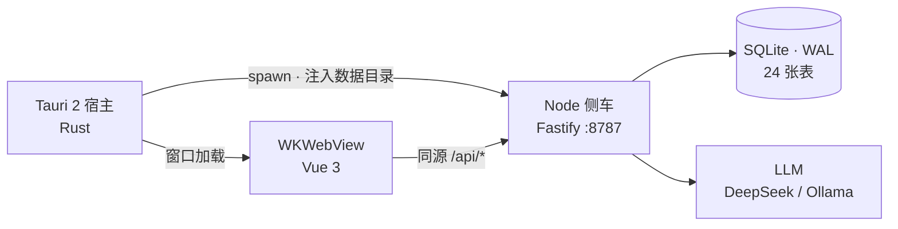

**完整架构文档**（运行时拓扑、分层边界、数据模型、学习闭环数据流、离线语音链路、
数据目录解析与迁移、21 条红线清单、已知技术债）：

👉 **[docs/ARCHITECTURE.md](docs/ARCHITECTURE.md)**

### 后端三层架构

调用链严格单向：`routes/ → controllers/ → services/`。

- **Route** 只声明路径与方法 → 禁止出现 `db.` / `drizzle-orm` / `axios`
- **Controller** 解析参数、决定状态码 → 禁止写 SQL
- **Service** 承载查询、事务、文件 IO → 禁止引用 `FastifyRequest` / `FastifyReply`
- **types/** 只放契约 → 禁止任何运行时值

### 数据模型

单库 SQLite（WAL 模式），24 张表。复习记录统一落在 `wb_review_log`，
而 SRS 列（`dueDate` / `easeFactor` / `masteredLevel`）**下沉到源表**
（`wb_note` / `wb_palace_loci`），不额外建卡表。

---

## 隐私与数据

- **无账号体系**：没有登录、没有注册、没有云端同步。
- **无遥测**：不收集任何使用数据，不发任何统计请求。
- **数据可带走**：SQLite 单文件 + 普通 Markdown 文件夹，随时打包迁移。
- **备份一致性**：打包前执行 `PRAGMA wal_checkpoint(TRUNCATE)`，保证 zip 里的库文件是完整快照。
- **AI 调用**：仅在你主动提问时，把问题与检索到的片段发给你配置的 provider。
  未配置 Key 时 AI 功能给出明确提示，**不会伪造结果**。
- **API Key 存储**：仅存本地 `ai-config.json`，不进代码、不进日志、不进版本控制。

---

## 已知限制

诚实记录，避免踩坑。

| 项 | 说明 |
|----|------|
| **仅 macOS** | 依赖 WKWebView 与原生托盘 API，未适配 Windows / Linux |
| **未公证** | 无 Apple Developer ID 签名，首次打开需 `xattr -cr` 解除隔离 |
| **Node 版本硬约束** | 必须 Node 24.16.0（ABI 137），否则原生模块加载失败 |
| **语音资源需自备** | Whisper / Piper 模型体积大，不随仓库分发，需 `scripts/fetch-models.sh` |
| **RAG 中文分词弱** | 关键词降级路径按空格/标点切分，**无空格的中文长问句检索命中率为 0**；配了 embeddings 模型走向量检索则不受影响 |
| **向量检索未规模化** | 当前为应用层余弦计算，约 5k 篇文档时 JS 堆峰值近 490MB；阈值与改造方案见架构文档 |
| **模拟面试会话不持久** | 面试会话存内存 `Map`，进程重启即失 |

完整技术债清单见 [`docs/ARCHITECTURE.md` §11](docs/ARCHITECTURE.md#11-已知技术债)。

---

## 贡献指南

欢迎贡献。开始之前请先读 **[CONTRIBUTING.md](CONTRIBUTING.md)**，其中有：

- 环境准备（**Node 24.16.0 的 ABI 约束**、原生模块重编译）
- 三层架构红线与前端设计令牌约束
- Conventional Commits 提交规范
- **提交前必跑的验收清单**（`vue-tsc --noEmit && vite build`、`cargo check --release`、接口契约快照对比）

### 快速开始

```bash
git clone git@github.com:beiluoL/LectoForge.git
cd LectoForge
npm --prefix src-api install && npm --prefix src-ui install && npm install
npm run dev:all
```

### 报告问题

请使用仓库的 [Issue 模板](.github/ISSUE_TEMPLATE/)：Bug 报告 / 功能建议。
标签体系（类型 / 模块 / 优先级 / 状态）说明见 [`.github/labels.md`](.github/labels.md)。

提交 Bug 时请附上 **macOS 版本、芯片类型、应用版本、以及是开发模式还是打包后的 `.app`**——
这几项信息能大幅缩短定位时间。

---

## 更新日志

版本历史与每个版本的新增 / 修复 / 已知问题见 **[CHANGELOG.md](CHANGELOG.md)**。

### 当前版本 **v1.2.0**（2026-08-26）

首个正式打标的发布版本，聚合了 v1.1.0 之后的全部工作：

- 🤖 **AI 与离线语音**：AI 助手多轮对话、知识库问答（RAG + 行号锚点）、学习日报（主动智能）、模拟面试、离线 STT（whisper.cpp 双轨）、本地 TTS（Piper）、离线 OCR
- 🎯 **学习闭环深化**：康奈尔笔记 5 大增强（沉浸阅读 / 反向引用 / AI 续写 / 自测题 / 一键导图 / 标签聚合 / PDF 导出）、收集箱进阶、复习体验升级
- 🎨 **绘图工具**（全新）：类 draw.io 白板，11 种形状、多页画布、对齐分布、模板库、AI 生成流程图
- 🗂 **规划完善**：任务清单（Things 3 式）、四象限、日历（含中国法定节假日）、习惯打卡、番茄钟
- 💻 **平台能力**：无边框沉浸式窗口、数据自动备份、CSV 导出、文档库拖拽移动、窗口尺寸记忆
- 🎛 **UI 设计体系**：主题系统（浅/深/跟随系统 + 6 档强调色）、字体自托管、全站一致性收敛、WCAG AA 对比度

### 历史版本

| 版本 | 日期 | 主题 |
|------|------|------|
| [v1.1.0](CHANGELOG.md#110---2026-08-07) | 2026-08-07 | 稳定性基建（侧车自愈 / 断线重连 / 数据目录注入 / 历史迁移）+ 间隔复习 / 命令面板 / 首页动态化 / 新手引导与设置中心 |
| [v1.0.0](CHANGELOG.md#100---2026-08-07) | 2026-08-07 | 首个版本：学习闭环四模块 + 文档库 + 思维导图 + 番茄钟 + 原生集成 |

### 发布说明

可直接用于 Release 页面的单版本说明见 [`docs/releases/`](docs/releases/)。

---

## 许可证

本项目基于 [MIT License](LICENSE) 开源。

---

<div align="center">

**LectoForge · 学习工作台**

如果这个项目对你有帮助，欢迎点一个 ⭐ Star

[GitHub](https://github.com/beiluoL/LectoForge) ｜ [Gitee](https://gitee.com/beiluol/lecto-forge)

</div>
