# LectoForge 架构与数据流

> 本文是 LectoForge 桌面端（macOS）的架构权威说明，覆盖：运行时拓扑、分层边界、数据模型、
> 核心数据流、离线语音链路、数据目录解析与迁移、性能与安全红线。
>
> 配套阅读：[`../README.md`](../README.md)（快速开始与功能总览）、[`../CONTRIBUTING.md`](../CONTRIBUTING.md)（开发约定）。

## 目录

- [1. 系统总览](#1-系统总览)
- [2. 进程、端口与资源](#2-进程端口与资源)
- [3. 后端分层架构](#3-后端分层架构)
- [4. 前端分层架构](#4-前端分层架构)
- [5. 数据模型概览](#5-数据模型概览)
- [6. 核心数据流：学习闭环](#6-核心数据流学习闭环)
- [7. 离线语音：STT 与 TTS 双轨](#7-离线语音stt-与-tts-双轨)
- [8. 侧车托管、自愈与数据目录](#8-侧车托管自愈与数据目录)
- [9. AI 能力层](#9-ai-能力层)
- [10. 红线清单](#10-红线清单)
- [11. 已知技术债](#11-已知技术债)

---

## 1. 系统总览

LectoForge 采用「**Rust 极薄壳 + Node 全功能后端 + Vue 前端**」的三进程结构。Rust 只负责窗口、
托盘、通知、备份调度与侧车生命周期——**不含任何业务逻辑**；所有业务能力集中在 Node 后端，
前端与后端**同源**（同一个 `127.0.0.1:8787`），因此没有 CORS、没有 WebSocket、没有鉴权层。

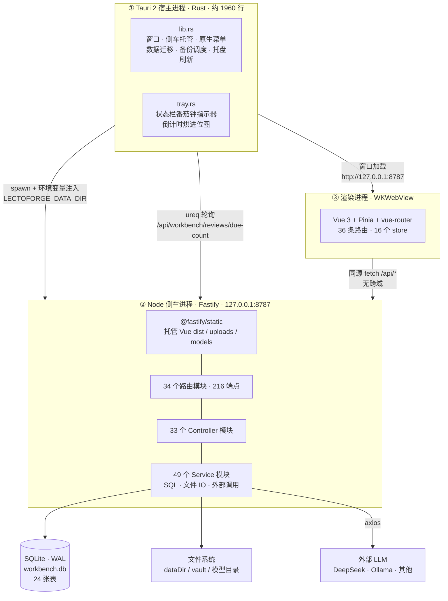

**为什么把后端放在 Node 而不是 Rust？** 为了与 Web 端学习工作台**共享同一套端点契约**
（`/api/workbench/*`）和同一套 SRS 算法实现（SM-2）。这样桌面端与 Web 端的数据可以互导，
算法行为逐位一致，避免两套实现漂移。

### 关键设计取舍

| 决策 | 选择 | 理由 |
|------|------|------|
| 前后端通信 | **同源 HTTP**，不用 IPC/WebSocket | 零 CORS、vue-router 可保持 history 模式、开发体验与普通 Web 应用一致 |
| 数据库 | **better-sqlite3（同步）** | 单文件、零部署；同步 API 免去异步事务的竞态，且 SQLite 本地读写延迟极低 |
| ORM | **Drizzle** | 类型安全且贴近 SQL，行为可预测（不像 ActiveRecord 那样隐式 N+1） |
| 桌面壳 | **Tauri 2** | 用系统 WebView，体积约 220MB（含 Node 运行时）；Electron 同功能约 2 倍 |
| 向量检索 | 应用层余弦相似度 | 数据量 < 1 万行时足够；规模化方案见 [§11](#11-已知技术债) |

---

## 2. 进程、端口与资源

| 进程 | 技术 | 职责 | 关键约束 |
|------|------|------|----------|
| 宿主 | Rust（`src-tauri/`） | 创建无边框窗口、托管侧车、原生菜单与托盘、通知、备份调度、数据迁移 | 业务零逻辑；仅 `lib.rs` / `tray.rs` 两个文件 |
| 侧车 | Node + Fastify（`src-api/`） | 全部业务能力、静态资源托管、SQLite 读写 | **必须 Node 24.16.0**（ABI 137） |
| 渲染 | WKWebView（`src-ui/`） | 全部 UI | 只能通过同源 HTTP 访问后端 |

### 端口策略

- **宿主模式**：Rust 先协商端口再启动侧车，**端口恒定不漂移**——已加载页面的断线重连依赖恒定 origin。
- **开发模式**（`npm run dev:api`）：允许 +1 漂移，仅绑 `127.0.0.1`。
- 默认端口 `8787`，可用 `--port` 覆盖。

### 打包必需资源

以下是 `tauri_build` **编译期就要校验**的资源，任何脚本都不可删除：

| 路径 | 用途 | 缺失后果 |
|------|------|----------|
| `src-ui/dist` | 前端产物，打进 `.app` 的 `Resources/web` | `build.rs` 校验失败 → **panic** |
| `binaries/server-<triple>` | Node 侧车可执行文件 | 同上 |
| `src-api/.prod-modules` | 后端生产依赖（含 `better-sqlite3` 原生模块） | 打包后 `require` 失败 → 白屏 |

`tauri.conf.json` 的 `bundle.resources` 必须包含 `../src-api/package.json`，
否则侧车启动时找不到 `main` 入口，表现为 **GUI 白屏**。

---

## 3. 后端分层架构

三层严格单向依赖：`routes/` → `controllers/` → `services/`，契约类型集中在 `types/`。

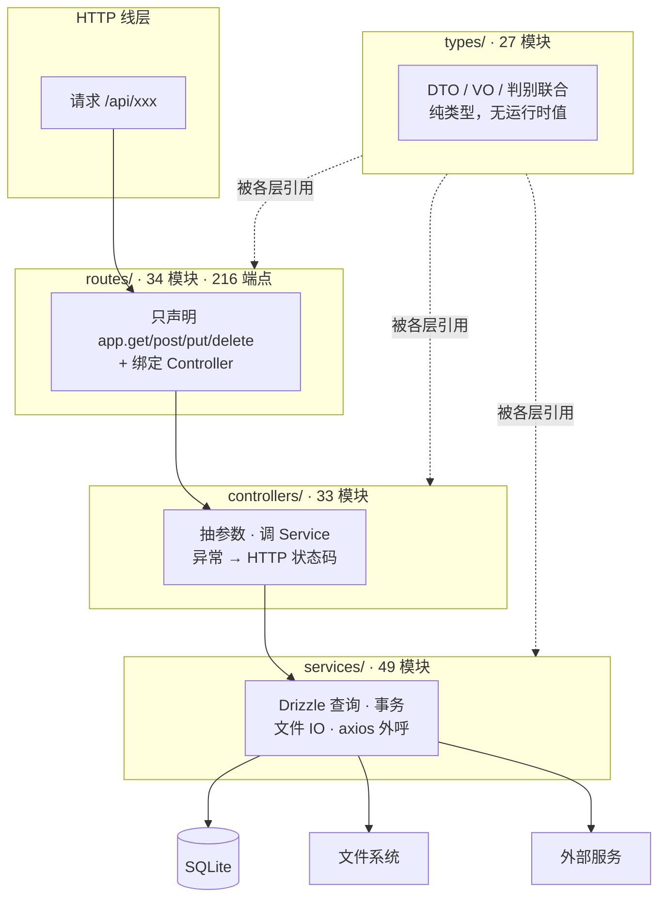

### 各层禁止事项

| 层 | 可以做 | **禁止** |
|----|--------|----------|
| Route | 声明路径与方法、绑定 Controller | `db.` / `drizzle-orm` / `axios` / `fetch(` |
| Controller | 解析参数、调 Service、决定状态码 | 写 SQL |
| Service | Drizzle 查询、事务、文件 IO、外部调用 | 引用 `FastifyRequest` / `FastifyReply` |
| types/ | 定义 DTO / VO / 判别联合 | 任何运行时值（常量、函数） |

### 响应信封：唯一包装点

成功响应统一为 `{ code: 200, data }`，由 `index.ts` 的 `onSend` 钩子**唯一负责**包装。
Controller 直接 `return` 纯数据即可——手写信封会造成**双重包装**。

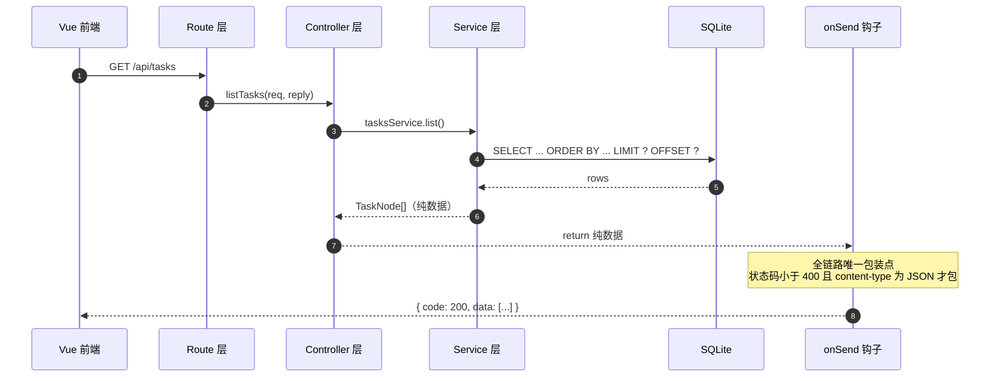

`onSend` 的包装条件（任一不满足则原样透传）：

1. `statusCode >= 400` → 不包（错误响应由 Controller 自行组织 `{ code, message }`）
2. `statusCode === 204` 或 payload 为空 → 不包
3. `content-type` 不是 `application/json` → 不包（静态资源、图片、SSE 流）
4. payload 解析后已含 `code` 与 `data` 字段 → 不重复包

### 两个例外：SSE 端点

`/api/interview/transcribe`、`/api/interview/answer` 需要**流式**返回，必须直写 `reply.raw`，
因此**不走 `onSend` 信封**。前端对这两个端点必须用 `postSSE()`（基于 `fetch` + `ReadableStream`），
**不能用浏览器原生 `EventSource`**（它只支持 GET，无法携带请求体）。

---

## 4. 前端分层架构

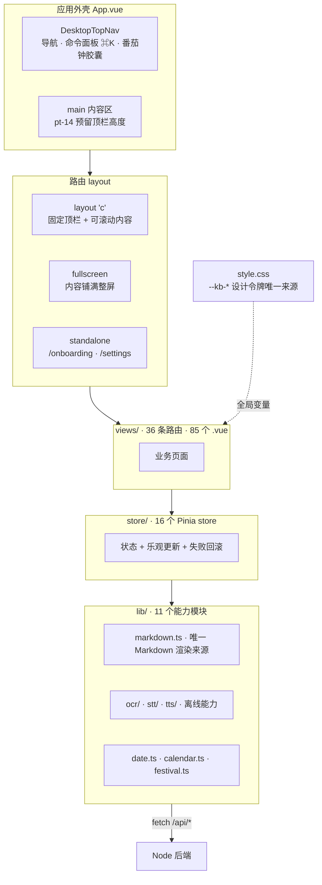

### 前端约束

- **设计令牌唯一来源**：`src-ui/src/style.css` 的 `--kb-*` 变量。禁止硬编码色值、字号、圆角、间距。
- **主题切换**：走 `documentElement[data-theme='dark']` + `color-mix`。**禁止 Tailwind 的 `dark:` 变体**。
- **Markdown 渲染唯一来源**：`src-ui/src/lib/markdown.ts`。不要另起渲染器。
- **Pinia store ID 一旦发布不可更改**：`defineStore('tasks', ...)` 中的 `'tasks'` 是持久化键名，改名 = 老用户数据丢失。当前 16 个 store：

  ```
  ai-assistant · ai-chat · app · calendar · daily-report · dashboard · diagram
  habits · inbox · memoryPalace · note · pomodoro · quadrant · review
  search · tasks
  ```

- **Tailwind 只用于布局**（flex / grid / spacing）；按钮、输入框等外观走全局类
  `.kb-btn*` / `.kb-input` / `.kb-label`。
- **`App.vue` 严禁 `overflow-hidden` 与 `mask-image`**；`<main>` 的 `pt-14` 必须保留（顶栏高度预留）。

### 路由 meta 约定

| meta | 含义 | 例子 |
|------|------|------|
| `fullscreen: true` | 内容铺满整屏 | `/library`、`/ai-chat`、`/tasks` |
| `standalone: true` | 不套顶栏，独立页面 | `/onboarding`、`/settings` |
| `fill: true` | 在固定容器内铺满（配合 `fixed top-14 left-0 right-0 bottom-0`） | `/ai-assistant`、`/tasks` |

---

## 5. 数据模型概览

单库 `workbench.db`（SQLite，WAL 模式），共 **24 张表**。

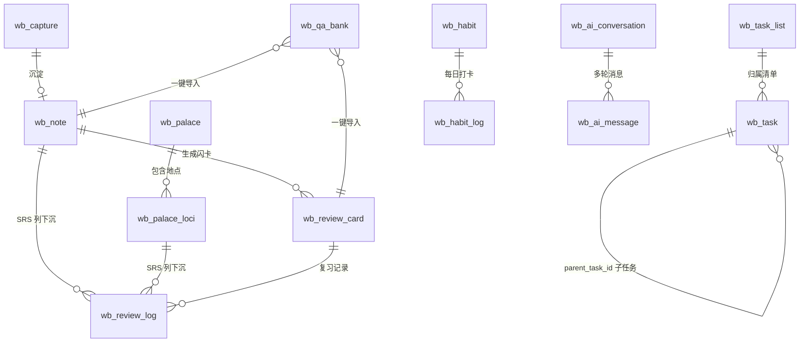

> 说明：`wb_review_log` 是**跨表 SRS 的公共落点**——复习记录统一挂在它上面，而
> `dueDate` / `easeFactor` / `masteredLevel` 这些 SRS 列**下沉到源表**
> （`wb_note` 与 `wb_palace_loci`），不额外建卡表。这是硬约束，见 [§10](#10-红线清单)。

### 表分组

| 域 | 表 |
|----|----|
| **捕捉与整理** | `wb_capture`、`wb_note`、`categories` |
| **记忆与复习** | `wb_review_card`、`wb_review_log`、`wb_palace`、`wb_palace_loci`、`wb_recall_session` |
| **输出** | `wb_story` |
| **规划** | `wb_task`、`wb_task_list`、`wb_task_template`、`wb_daily_task`、`wb_quadrant_task`、`wb_calendar_event`、`wb_anniversary` |
| **习惯与专注** | `wb_habit`、`wb_habit_log`、`wb_pomodoro_log` |
| **创作工具** | `wb_diagram`、`wb_embedding` |
| **AI** | `wb_ai_conversation`、`wb_ai_message`、`wb_qa_bank` |

> `wb_task_template` 与 `wb_daily_task` 是原「日程计划」模块的遗留表，现作为**迁移来源与日历读取来源**保留，
> 不再有独立前端入口。

### 外键与级联

SQLite 默认**不启用**外键约束。项目通过 **Service 层的同步事务**手工维护级联删除，例如：

```ts
// 删除习惯时级联删掉它的全部打卡记录（同步事务，回调不得 async）
db.transaction((tx) => {
  tx.delete(wbHabitLog).where(eq(wbHabitLog.habitId, id)).run();
  tx.delete(wbHabit).where(eq(wbHabit.id, id)).run();
});
```

---

## 6. 核心数据流：学习闭环

产品的核心是一条**四步闭环**——输入 → 整理 → 内化 → 输出，再由间隔重复提供长期记忆的
「复习杠杆」，由学习日报提供「复盘杠杆」。

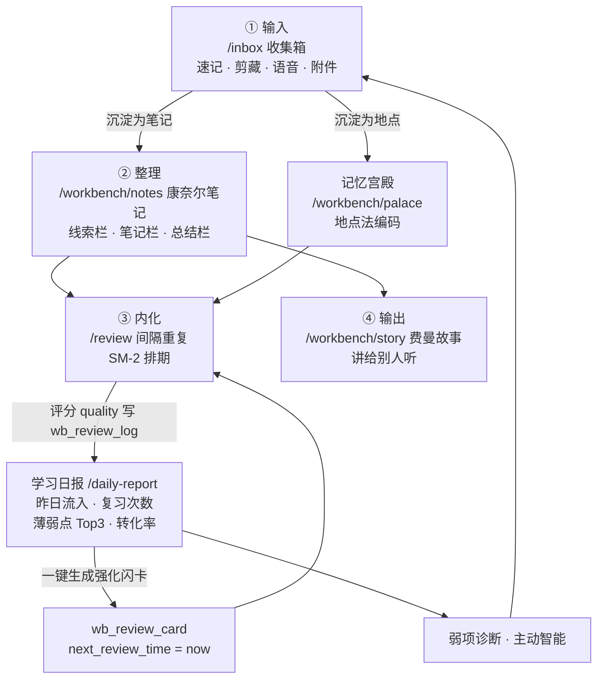

### 各环节技术要点

| 环节 | 前端 | 后端 | 关键约束 |
|------|------|------|----------|
| **① 输入** | `/inbox`，`inbox-store` | `/api/inbox`（14 端点）+ `/api/workbench/captures`（7） | 剪藏走 cheerio 解析；附件/录音走 `@fastify/multipart` → `uploads/` |
| **② 整理** | `/workbench/notes`，三栏 + 划词工具栏 | `/api/workbench/notes`（9 + 3 增强） | 双链 `[[...]]` + 反向引用 `backlinks`；标签聚合下推 SQL |
| **记忆宫殿** | `/workbench/palace` | `/api/workbench/palaces`（10） | SRS 列下沉到 `wb_palace_loci` |
| **③ 内化** | `/review`，翻卡 + 四档评分 | `/api/reviews`（9）+ `/api/review`（9） | SM-2 须与 Web 端 `sm2.dart` **逐位一致** |
| **④ 输出** | `/workbench/story` | `/api/workbench/stories`（5） | AI 起草 + 清晰度评分 |
| **复盘** | `/daily-report` | `/api/insight`（4） | 「昨日」必须用 `date(col,'localtime')`，非裸 UTC |

### SM-2 排期的一个易错点

下次到期时间必须基于「**上次复习时间 + interval**」计算，**而不是**基于当前时间累加。
否则多次延迟复习会把间隔不断向后推，卡片永远不到期。

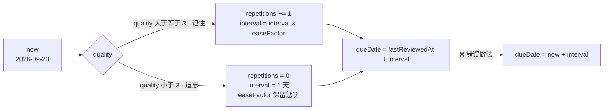

---

## 7. 离线语音：STT 与 TTS 双轨

语音能力全部**本地运行**，不依赖任何云服务。

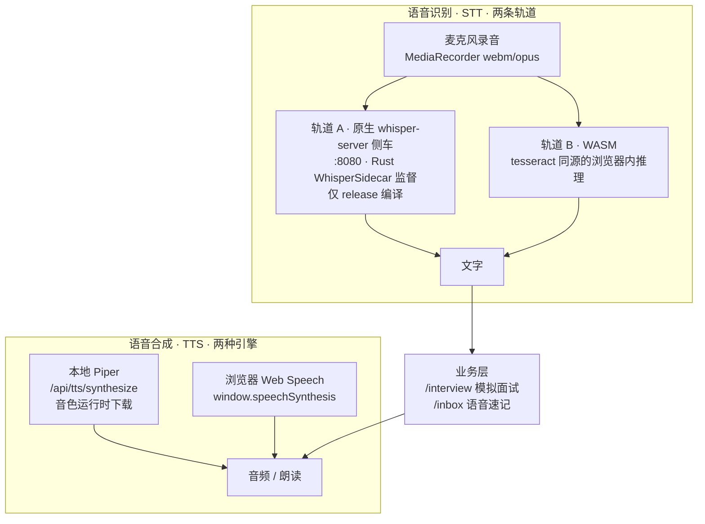

### 关键技术约束

- **浏览器录音是 `webm/opus`，Whisper 要 PCM16 WAV**——必须先经
  `src-ui/src/lib/stt/audio.ts` 的 `blobToWav()` 转换，否则识别结果为空。
- **Whisper 侧车刻意不进 `externalBin`**：避免开发者机器（未装模型）执行 `tauri build` 时直接断裂。
  缺二进制或模型时**静默跳过不崩窗**。dev 环境手动启动：`bash scripts/run-whisper.sh`。
- **Piper TTS 音色是运行时下载**的，模型走 `/models/piper/`；`src-api/src/index.ts` 用**双根托管**
  同时暴露 `dataDir` 与 `resources/models` 两个静态根。
- **OCR** 走 `tesseract.js`（WASM），中文优先，模型在 `/models/tesseract/`；
  `getMissingOcrResources()` 先做 HEAD 预检，缺资源时给明确提示而非静默失败。

---

## 8. 侧车托管、自愈与数据目录

### 启动与自愈

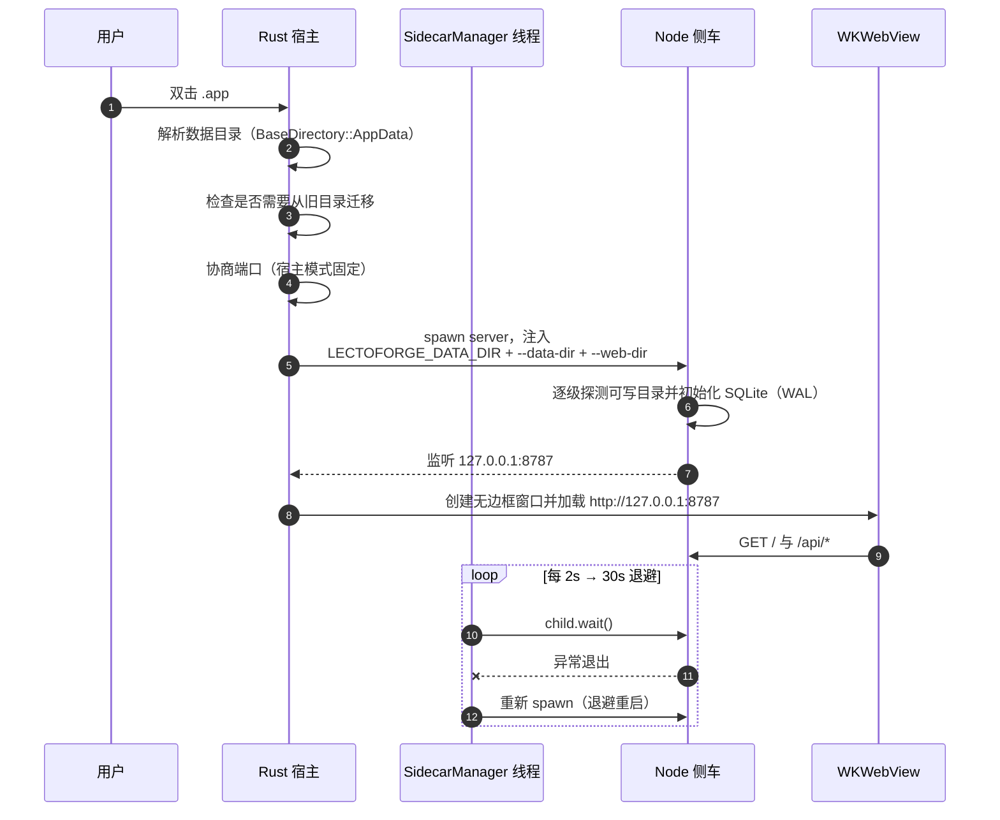

- **自愈重启**：侧车异常退出后按 2s → 30s 退避**无限重启**；存活满 30s 自动重置退避；
  退出码 0（含孤儿自检）不重启。应用退出时 `SIGTERM`，2s 未退则 `SIGKILL`。
- **前端断线重连**：网络抖动或侧车重启期间，连接状态机自动探测，用公共 `replayRequest`
  重放进行中的请求，并弹出毛玻璃「重新连接」遮罩，恢复后无感续接。
- **孤儿自检**：侧车检测到 `ppid === 1`（已脱离宿主）时主动退出，避免僵尸后端堆积。

### 数据目录解析优先级

打包后 `.app` 包内是**只读**的（且写入会破坏代码签名），所以任何落盘都必须落在包外。

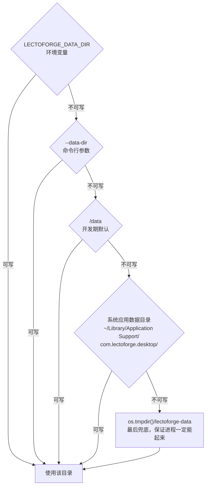

判定用的是「创建 + `W_OK` 探测」的**实证判断**，而不是 `existsSync`——
`.app` 包内目录是存在的，但写入会 `EROFS`/`EPERM`，那样 better-sqlite3 会在
`new Database()` 那一刻直接抛错、整个后端起不来。

### isLaunchedByHost() 的影响

「有 `LECTOFORGE_DATA_DIR` 或 `--data-dir`」即视为**被宿主拉起**，这会改变三个行为：

| 行为 | 宿主模式 | 独立开发模式 |
|------|----------|--------------|
| 孤儿自检（`ppid === 1` 退出） | ✅ 启用 | ❌ 关闭 |
| 端口 | 固定不漂移 | 允许 +1 漂移 |
| 清晨日报推送（本地 08:00） | ✅ 启用 | ❌ 不触发 |

### 历史数据迁移

产品由 **KnowFlow** 更名为 **LectoForge** 后 bundle identifier 随之改变
（`com.knowflow.desktop` → `com.lectoforge.desktop`），AppData 会指向全新空目录。
宿主启动时若发现：

1. 新目录尚无 `workbench.db`，**且**
2. 旧目录 `com.knowflow.desktop/` 中存在数据

则**一次性递归复制**历史数据（笔记库、思维导图、上传件、AI 配置）。
旧目录**保留不删**作为回滚安全网；已迁移过则自动跳过，**幂等**。

> ⚠️ `src-tauri/src/lib.rs` 中的 `LEGACY_APP_IDENTIFIER = "com.knowflow.desktop"` 是迁移逻辑的
> 唯一依赖，**不可删除**。

### 数据目录布局

```
<dataDir>/
├── workbench.db            SQLite 主库（含 -wal / -shm）
├── ai-config.json          AI provider 配置（含 API Key）
├── config.json             应用级配置（新手引导状态 + 偏好数据目录）
├── pomodoro-config.json    番茄钟偏好
├── backup-config.json      备份计划
├── library-workspace.json  文档库 vault 根路径
├── last-daily-report.json  清晨推送的日报快照
├── mindmaps/               思维导图文件
├── uploads/                录音 / 图片 / 附件
└── logs/                   运行日志
```

**备份**（`POST /api/backup`）会把 `db/`、`uploads/`、`config/`、`mindmaps/` 与一份
`backup-meta.json` 打成 `lectoforge-backup-YYYYMMDD-HHmmss.zip`。打包前先执行
`PRAGMA wal_checkpoint(TRUNCATE)`，把 WAL 中未落盘的事务刷进主库，
保证 zip 里的 `.db` 单文件就是完整快照。

---

## 9. AI 能力层

所有 LLM 调用收敛在 `src-api/src/lib/llm.ts`，**provider 无关**——切换模型只改 `baseUrl` 与配置。

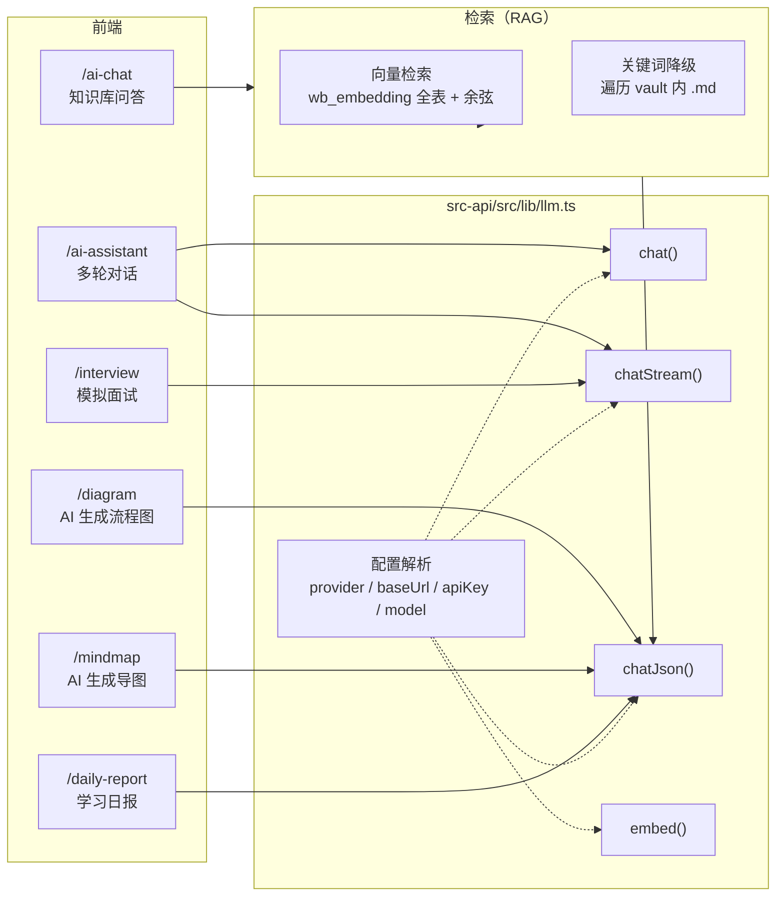

### Provider 与降级

| provider | baseUrl | 说明 |
|----------|---------|------|
| `deepseek` | `https://api.deepseek.com/v1` | 默认 |
| `openai` | 官方端点 | 兼容 |
| `local` | `http://localhost:11434/v1` | Ollama，**放宽 apiKey 强校验**（本地模型无 Key） |

**优雅降级**是硬要求：未配置 Key 时，AI 功能必须返回清晰的「未配置」提示或 mock 骨架，
**不允许**抛错崩页或伪造成功结果。

### RAG 检索链

1. **向量检索优先**：把 query 向量化，与 `wb_embedding` 中全部向量算余弦相似度，取 Top-N。
   不可用（未配 embeddings 模型）则降级。
2. **关键词检索降级**：遍历 vault 内 `.md`（上限 `MAX_DOC_FILES`），对命中行抽取片段**与精确行号区间**。
3. 组装上下文 → 注入 prompt → `chatJson()` 强制 JSON 输出 → 校验来源链接真实可跳转后才返回。

来源药丸带 `anchor`（形如 `L3-L7`），前端点击后 `router.push('/library?doc=<relId>&highlight=<anchor>')`，
编辑器滚动到对应行区间并高亮 3 秒淡出。

---

## 10. 红线清单

以下是**架构级约束**，违反会造成数据丢失、行为退化或打包失败。

### 数据

| # | 红线 | 违反后果 |
|---|------|----------|
| 1 | `wb_review_log` 是跨表 SRS 的公共落点；SRS 列（`dueDate` / `easeFactor` / `masteredLevel`）**下沉到源表**，不另建卡表 | 两套 SRS 状态漂移，复习排期错乱 |
| 2 | SM-2 实现必须与 Web 端 `lectoforge_mobile/utils/sm2.dart` **逐位一致** | 跨端数据互导后排期不一致 |
| 3 | 数据目录下的固定文件名不可改名（`workbench.db` / `ai-config.json` / …） | 用户历史数据无法定位 = 数据丢失 |
| 4 | Pinia store ID 一旦发布不可更改 | 持久化插件按 ID 存盘，改名 = 老用户数据丢失 |
| 5 | `LEGACY_APP_IDENTIFIER = "com.knowflow.desktop"` 不可删除 | 老用户无法迁移历史数据 |
| 6 | 新增数据表时，索引名必须带表名前缀（`idx_<表名>_<字段>`） | 索引名冲突 |

### 性能

| # | 红线 | 违反后果 |
|---|------|----------|
| 7 | 新增 list 端点**必须**分页（`.limit().offset()`，统一走 `lib/pagination.ts`） | 大数据量下拉全量，内存暴涨 |
| 8 | `GET /api/calendar/events` **必须**带 `start_date` / `end_date`，用「区间重叠」命中 | 拉全量事件；跨月长事件漏显示 |
| 9 | 树结构在 **Service 层**拼装（O(n) 单趟），前端**禁止**再 filter 组树 | N+1 查询与前端重复计算 |
| 10 | 习惯 / 四象限列表必须用**固定条数 SQL**（JOIN + 内存分组），不随条目数线性增长 | N+1 |
| 11 | 业务层**不得**出现同步 API 的 `async` 包装；`db.transaction()` 回调禁 async | 事务在首个 `await` 处提前提交 |

### 打包与运行

| # | 红线 | 违反后果 |
|---|------|----------|
| 12 | `src-ui/dist` / `binaries/server-<triple>` / `src-api/.prod-modules` **不可删除** | `build.rs` panic，无法打包 |
| 13 | `bundle.resources` 必须含 `../src-api/package.json` | 打包后 GUI 白屏 |
| 14 | 必须用 **Node 24.16.0**（ABI 137） | `better-sqlite3` `ERR_DLOPEN_FAILED` → API 崩 → 前端 `ECONNREFUSED` |
| 15 | `cfg(not(debug_assertions))` 内的 Rust 代码须用 `cargo check --release` 验证 | 普通 `cargo check` 不编译该分支，错误漏到打包期 |
| 16 | build 模式**禁止**动态 `import('@tauri-apps/api/*')`，一律顶层静态 import | 打包后模块解析失败 |
| 17 | `/calendar` 与 `/tasks` 路由不得挂 `/workbench` 前缀 | 顶栏 `startsWith` 高亮被「工作台」误吞 |

### UI

| # | 红线 | 违反后果 |
|---|------|----------|
| 18 | 设计令牌唯一来源 `style.css` 的 `--kb-*`；禁止硬编码色值/字号/圆角/间距 | 主题切换（明/暗、强调色）失效 |
| 19 | 禁止 Tailwind `dark:` 变体，主题只走 `data-theme` + `color-mix` | 双主题机制互相打架 |
| 20 | Markdown 渲染唯一来源 `lib/markdown.ts` | 两套渲染器样式与安全策略不一致 |
| 21 | `App.vue` 严禁 `overflow-hidden` / `mask-image`；`<main>` 的 `pt-14` 必须保留 | 内容被裁切或顶栏遮挡 |

---

## 11. 已知技术债

诚实记录，尚未修复。

### 1. 向量检索的规模化瓶颈

`aiRagService.vectorRetrieve` 当前走「**全表拉入 JS + JSON.parse + 余弦**」的应用层计算，
瓶颈是 JS 堆峰值——约 5k 篇文档时堆峰值接近 490MB。

- **触发门槛**：embedding 行数 > ~10k，或单次查询延迟 > 100ms，或堆峰值 > 300MB。
- **目标方案**：改用 sqlite-vec 的 `vec0` 虚拟表做原生 KNN，抽成
  `searchSimilarEmbeddings(queryVec, model, k)`。
- **现状**：未实现。

### 2. RAG 关键词降级路径对中文提问分词不足

关键词检索（`retrieveDocsKeyword`）的 `tokenize()` **只按空格与标点切分**。
中文无空格提问（如「间隔重复的复习间隔应该怎么算？」）会被当成**一个超长词条**，
无法命中任何行，最终返回「知识库中未找到相关内容」。

- **现象**：写成长句的纯中文提问检索命中率为 0；写成「间隔重复 复习间隔 怎么算」即可命中。
- **影响**：仅影响**关键词降级路径**。若 embeddings 模型可用（向量检索优先），不受影响。
- **建议方向**：引入轻量中文分词（如 `nodejieba` / `Intl.Segmenter`）替代当前的标点切分。

### 3. `/api/ai/associate` 关联项标题恒空

`aiEmbeddingService.ts` 的 `/associate` 读取 `e.entity_type` / `e.entity_id`，
但 Drizzle 实际返回 **camelCase**（`entityType` / `entityId`），导致关联项的标题查询恒为空。
修复时应单独提交 `fix(ai): ...`。

### 4. 文档中的聚合数字易失真

本文与 `README.md` 中的数字均为 **2026-08-26 全量脚本审计值**（34 模块 / 216 端点 / 24 表 / 36 路由）。
历史上曾因手工累加出现过自相矛盾，后续**一律以脚本审计为准**，审计脚本见附录「数字口径」，避免手工维护。

### 5. 离线语音资源未随仓库分发

`resources/models/whisper/` 与 `resources/models/piper/` **默认为空**——
模型体积过大不宜入库。因此**语音输入输出开箱不可用**，需先执行：

```bash
bash scripts/fetch-models.sh    # tesseract / whisper 模型
bash scripts/build-whisper.sh   # 编译 whisper-server
bash scripts/build-piper.sh     # 编译 piper
```

应用对此**已做优雅降级**（缺资源时给出明确提示，不崩窗），但用户体验上仍是断链。

---

## 附：数字口径

本文所有计数来源于 **2026-08-26 脚本审计**，复现方式：

```bash
# 后端路由模块数与端点数
ls src-api/src/routes/*.ts | wc -l
grep -rhoE "app\.(get|post|put|patch|delete)\(" src-api/src/routes/*.ts | wc -l

# 数据表数
python3 - <<'EOF'
import re
src = open('src-api/src/db/schema.ts', encoding='utf-8').read()
print(len(re.findall(r"sqliteTable\(\s*['\"]([^'\"]+)['\"]", src)))
EOF

# 前端路由数（命名页面数）
grep -cE "path: '" src-ui/src/router/index.ts
grep -cE "^\s+name: '" src-ui/src/router/index.ts

# Vue 单文件组件数
find src-ui/src -name "*.vue" | wc -l

# Pinia store 数（store 目录下除 index.ts 外的模块数）
ls src-ui/src/store/*.ts | grep -v "index.ts$" | wc -l

# Rust 代码行数
wc -l src-tauri/src/*.rs | tail -1
```

> 注：store ID 有的写成单行 `defineStore('tasks', ...)`，有的换行写，
> 所以**不要**用 `grep defineStore` 统计数量——按 `store/` 目录下的模块文件数最可靠。

| 指标 | 值 |
|------|-----|
| 后端路由模块 | 34 |
| 后端端点（路由模块内） | 216 |
| `index.ts` 直挂端点 | 2（`GET /api/health`、`GET /`） |
| 后端 HTTP 路由合计 | 218 |
| 数据表 | 24 |
| 前端路由记录 | 36（含重定向与别名） |
| 前端具名页面 | 30 |
| Vue 单文件组件（`src-ui/src` 合计） | 101 |
| ↳ 其中 `src/views` 下 | 85 |
| Pinia store | 16 |
| Rust 源码 | 3 文件 / 1960 行 |

---

*本文档随代码演进同步维护。若你的改动涉及端点数量、数据表数量、路由数量或目录结构，
请一并更新本文与 `README.md`。*
